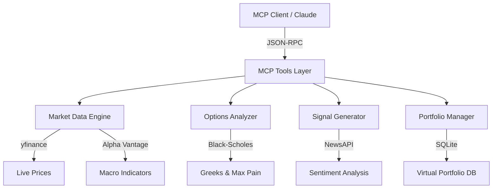

# 🇮🇳 IndiaQuant MCP Server

A state-of-the-art Model Context Protocol (MCP) server providing real-time Indian stock market intelligence, derivatives analysis, and virtual trading capabilities.


## 🌟 Overview

IndiaQuant MCP transforms any AI agent (like Claude Desktop) into a high-performance quant assistant. It bridges the gap between static LLM knowledge and the live pulse of the National Stock Exchange (NSE) and Bombay Stock Exchange (BSE).

### Key Capabilities
- 📈 **Live Market Data**: Real-time quotes and historical OHLC data.
- 🧪 **Quant Signals**: Technical indicator analysis (RSI, MACD, BB) fused with news sentiment.
- 📐 **Derivatives Intelligence**: Black-Scholes Greeks (Delta, Gamma, Theta, Vega) and Max Pain calculation.
- 💼 **Virtual Portfolio**: Persistent SQLite-backed tracking with automatic stop-loss/target management.
- 🔍 **Market Scanning**: Unusual options activity detection and RSI-based sector scanning.

---

## 🏗️ System Architecture



### Core Modules
| Module | Responsibility |
| :--- | :--- |
| **Market Data Engine** | NSE/BSE quote fetching, symbol formatting, and TTL caching (5 mins). |
| **Options Analyzer** | Derivatives chain parsing, Max Pain point discovery, and pure-math Greeks. |
| **Signal Generator** | Multi-factor confidence scoring (Technicals + Chart Patterns + Sentiment). |
| **Portfolio Manager** | Trade execution, P&L calculation, and volatility-based risk scoring. |
| **Database** | SQLite-backed persistence for positions and cash balance. |

---

## 🛠️ Setup & Installation

### 1. Prerequisites
- **Node.js** v20.x or higher.
- **API Keys**:
  - [NewsAPI](https://newsapi.org/) (Free)
  - [Alpha Vantage](https://www.alphavantage.co/) (Free)

### 2. Configuration
Create a `.env` file in the root directory:
```env
NEWS_API_KEY=your_news_api_key
ALPHA_VANTAGE_API_KEY=your_alpha_vantage_key
```

### 3. Installation
```bash
npm install
npm run build
```

### 4. Integration with Claude Desktop
Add the following to your `claude_desktop_config.json`:
```json
{
  "mcpServers": {
    "indiaquant": {
      "command": "node",
      "args": ["C:/Users/Lenovo/MCP-VectorAssignment/dist/index.js"],
      "env": {
        "NEWS_API_KEY": "your_news_api_key",
        "ALPHA_VANTAGE_API_KEY": "your_alpha_vantage_key"
      }
    }
  }
}
```

---

## 📊 MCP Tools Reference

| Tool Name | Parameters | Returns |
| :--- | :--- | :--- |
| `get_live_price` | `symbol` | Price, Change%, Volume, High/Low. |
| `get_options_chain` | `symbol, expiry` | Full chain with Strikes, OI, and Max Pain. |
| `analyze_sentiment` | `symbol` | Sentiment score, headlines, and signal (Bullish/Bearish). |
| `generate_signal` | `symbol, timeframe` | BUY/SELL/HOLD signal with confidence % and patterns. |
| `get_portfolio_pnl` | - | Positions, Total P&L, Portfolio Value, and Risk Scores. |
| `place_virtual_trade` | `symbol, qty, side, sl, target` | Order ID, status, and new cash balance. |
| `calculate_greeks` | `symbol, strike, type, expiry` | Delta, Gamma, Theta, Vega from scratch BS math. |
| `detect_unusual_activity` | `symbol` | High Volume/OI ratio alerts and anomalies. |
| `scan_market` | `rsiBelow, rsiAbove` | List of stocks matching technical criteria. |
| `get_sector_heatmap` | - | Performance of Nifty 50, IT, Bank, etc. |
| `get_macro_indicators` | - | Global macro data (Inflation, GDP) from Alpha Vantage. |

---

## ⚖️ Technical Decisions & Trade-offs
- **TypeScript**: Chosen for strong typing (essential for financial logic).
- **SQLite**: Used for local persistence to enable stateful portfolio management without external DB overhead.
- **TTL Caching**: Implemented a 5-minute cache for live prices to manage API rate limits efficiently.
- **Pure Math Greeks**: Implemented Black-Scholes from scratch to avoid dependency on external black-box libraries for critical quant logic.

---

## 📜 License
ISC License. Built for the IndiaQuant Software Developer Take-Home Assignment.
